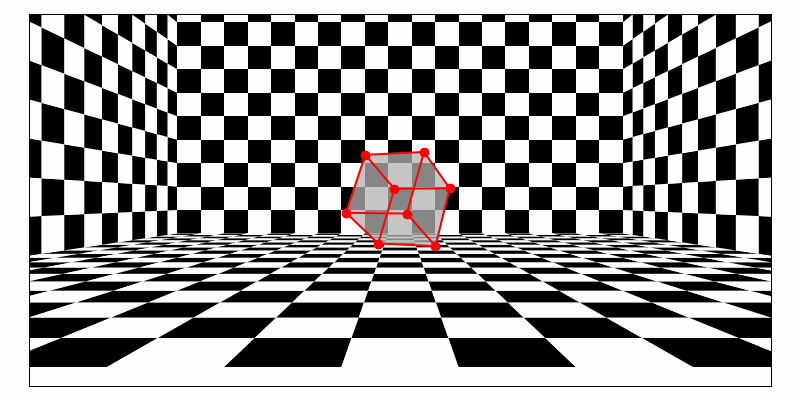

# CameraGeometrySimulations

This repository explores the principles of single-view metrology and the dolly zoom effect through Python simulations.

## Table of Contents
- [Introduction](#introduction)
- [Features](#features)
- [Installation](#installation)
- [Usage](#usage)
- [Examples](#examples)
- [Contributing](#contributing)
- [License](#license)

## Introduction
CameraGeometrySimulations is a collection of Python scripts and simulations designed to demonstrate the principles of single-view metrology and the dolly zoom effect. These simulations help visualize how camera geometry impacts image perception and measurements.

## Features
- Simulate single-view metrology to measure distances and angles from a single image.
- Demonstrate the dolly zoom effect, also known as the "vertigo effect".
- Visualize the impact of camera movements on image geometry.

## Installation
To get started with CameraGeometrySimulations, clone the repository and install the required dependencies:

```sh
git clone https://github.com/JorgeCuerv0/CameraGeometrySimulations.git
cd CameraGeometrySimulations
pip install -r requirements.txt
```

## Usage
Run the simulations using the provided Python scripts. For example, to run the single-view metrology simulation:

```sh
python single_view_metrology.py
```

To demonstrate the dolly zoom effect:

```sh
python dolly_zoom.py
```

## Examples
Here are some examples of the simulations in action:

### Dolly Zoom Effect


## Contributing
Contributions are welcome! If you have any ideas for improvements or new features, please feel free to open an issue or submit a pull request.
